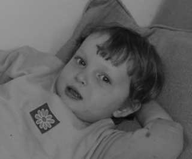
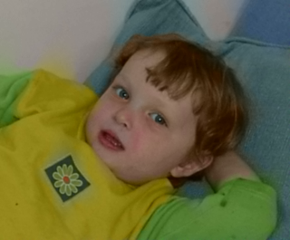
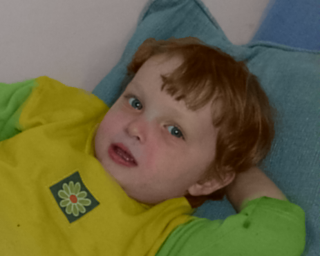

# Colorisation d'une photo noir et blanc

La colorisation est un processus assisté par ordinateur qui consiste à rajouter de la couleur à une photo ou un film monochrome. Dans les algorithmes classiques de colorisation, l'algorithme segmente l'image en régions. En pratique, ce n'est pas une tâche robuste et l'intervention de l'utilisateur reste une tâche pénible et consommatrice de temps.

L'algorithme utilisé dans notre programme est une méthode de colorisation qui ne demande pas une segmentation précise de l'image mais se base sur la simple supposition que des pixels voisins ayant des intensités de gris similaires devraient avoir une couleur similaire. Cet algorithme a été proposé par A. Levin, D. Lischinsky et Y. Weiss dans le papier au Sig'graph 2004: "Colorization using Optimization".

Cet algorithme est robuste. Pour colorier une image, il suffit d'avoir une photo monochrome, et créer une seconde image contenant des aplats de couleurs indiquant les couleurs de plusieurs zones de la photo. On parle alors de photo marquée.

Exemple de photo monochrome :

Exemple de photo monochrome marquée :

L'espace colorimétrique utilisé pour la colorisation de l'image est l'espace colorimétrique $YC_{b}C_{r}$ qui fut utilisé principalement par la télévision.

On note $Y(r)$ la valeur de l'intensité pour le pixel $r$ et $U(r)$ la valeur d'une composante couleur ($C_{b}$ ou $C_{r}$).

L'idée de l'algorithme est de minimiser la "distance" entre la couleur $U(r)$ du pixel $r$ et la couleur moyenne pondérée $U(s)$ des pixels voisins. On essaye donc de minimiser

$$
J(U) = \sum_{r}\left(U(r) - \sum_{s\in\mathcal{N}(r)}w_{r}(s)U(s)\right)^{2}
$$

où

- $\mathcal{N}(r)$ est l'ensemble des pixels voisins,
- $w_{r}(s)$ est une fonction poids dont la somme sur $s$ est égale à un, le poids est grand quand $Y(r)$ est similaire à $Y(s)$ et très petit quand les deux valeurs sont différentes.

Notons que la couleur sera fixée pour un sous-ensemble de pixels : là où l'artiste aura mis ses indications de pixels.

Il existe plusieurs choix pour cette fonction poids. On choisira ici la fonction poids suivante (à normaliser pour que la somme soit égale à un) :

$$
w_{r}(s) = 1 + \frac{1}{\sigma_{r}}(Y(r)-\mu_{r})(Y(s)-\mu_{r})
$$

où

- $\mu_{r}$ est la moyenne de l'intensité du pixel $r$ et de ses voisins;
- $\sigma_{r}$ est la variance de l'intensité du pixel $r$ et de ses voisins.

La fonction quadratique $J(u)$ peut être exprimée sous forme matricielle :

$$
J(U) = \left(\left(I - W\right).U\right)^{T}.\left(\left(I - W\right).U\right) = (C.U)^{T}(C.U)
$$

Pour prendre en compte les pixels dont on a fixé les couleurs (on dit qu'ils suivent une **condition de Dirichlet**), nous allons les séparer des pixels dont les couleurs ne sont pas fixées. On décompose donc $U$ comme :

$$
U = U_{F} + x
$$

où $U_{F}$ est l'ensemble des valeurs fixées (par la couleur imposée) et $x$ l'ensemble des valeurs "libres".

De fait, on a donc :

$$
C.U = C.U_{F} + C.U_{L} = y + C.x
$$

avec $y=C.U_{F}$.

On a donc :

$$
J(U) = (y+Cx)^{T}(y+Cx)
$$

soit

$$
J(U) = y^{T}.y + 2.y^{T}(Cx) + x^{T}C^{T}Cx
$$

Puisque $y^{T}.y$ est constant, il suffit donc de minimiser la fonctionnelle :

$$
\tilde{J}(U) = 2.y^{T}(Cx) + x^{T}C^{T}Cx
$$

Pour minimiser la fonctionnelle, nous allons utiliser un algorithme de gradient conjugué :

- $r_{0} = y - C.x_{0}$
- $g_{0} = C^{T}.r$
- $p_{0} = g_{0}$
- $\alpha = \frac{\|g_{0}\|^{2}}{\|p_{0}\|^{2}}$
- $x_{1} = x_{0} + \alpha.p_{0}$
- $r_{1} = r_{0} - \alpha.C.p_{0}$
- Tant que non convergé :  
  - $g_{i+1} = C^{T}.r_{i}$
  - $\beta = -\frac{\|g_{i+1}\|^{2}}{\|g_{i}\|^{2}}$
  - $p_{i+1} = g_{i+1} - \beta.p_{i}$
  - $\alpha = \frac{\|g_{i+1}\|^{2}}{\|p_{i+1}\|^{2}}$
  - $x_{i+1} = x_{i} + \alpha.p_{i}$
  - $r_{i+1} = r_{i} - \alpha.C.p_{i}$

L'algorithme nécessite donc  deux produits matrice-vecteur :

- $v = C.u$ et
- $v = C^{T}.u$

Notons que pour les pixels dont la couleur est fixée, on modifie la matrice $C$ en adéquation en annulant les lignes et colonnes correspondantes.

## Les tests

L'image servant de test est reprise de l'article.

Résultat obtenu avec notre algorithme :

Résultat obtenu avec l'algorithme proposé dans l'article :

Vous remarquerez sûrement des petites différences entre le résultat trouvé par l'article et le résultat trouvé ici. Cela est dû sûrement à plusieurs raisons :

- Dans l'article, ils utilisent l'espace colorimétrique $YUV$ plutôt que $YC_{b}C_{r}$.
- Le solveur utilisé n'est pas un gradient conjugué mais une méthode dite multi-grille, trop compliquée à paralléliser mais plus efficace que faire un gradient.

## À FAIRE

### Donner la configuration de votre ordinateur

- Nombre de coeurs de calcul
- Mémoires caches

### Paralléliser le code

- Dans un premier temps, faites une partition de l'image en *nbp* tranches d'images et demandez à chaque processus d'essayer de coloriser sa portion d'image à partir des conditions de Dirichlet correspondant à sa portion d'image et en construisant une matrice uniquement locale à cette portion d'image. Vous nommerez le fichier parallélisé <b>colorize1.py</b>
- Bien que le résultat obtenu soit convenable, pourquoi la stratégie ci-dessus peut mener à des portions d'images qui soient non colorées ?
- Dans un deuxième temps, construire une partie de la matrice globale (correspondant à l'image complète) et paralléliser les produits
  matrice-vecteur ainsi que le gradient conjugué afin de résoudre un problème global en parallèle plutôt que
  plusieurs problèmes locaux. Vous nommerez le fichier parallélisé <b>colorize2.py</b>

On calculera ensuite l'accélération obtenue pour les diverses parties parallélisées du code.

À la fin de l'examen, vous enverrez vos trois fichiers (*README_nom_prenom.md*, *colorize1.py*, *colorize2.py*) **non archivés à votre chargé de TD** aux adresses e-mail suivant :

  - xavier.juvigny@onera.fr
  - jean-didier.garaud@onera.fr
  - apf@crans.org

Avant de quitter la salle d'examen, attendez que votre chargé de TD confirme qu'il a bien reçu vos fichiers et n'oubliez pas de signer la feuille de présence avant de partir